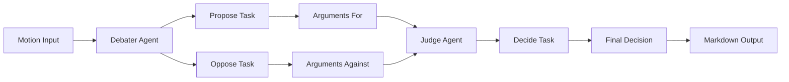

# AI Debate Arena - Intelligent Argumentation System

An advanced multi-agent AI debate platform powered by [crewAI](https://crewai.com) that facilitates structured debates on any topic. The system employs specialized AI agents to present compelling arguments from multiple perspectives and an impartial judge to evaluate and decide the winner.

## 🎯 Overview

AI Debate Arena is an intelligent argumentation system that simulates real-world debates using multiple AI agents. Each agent has a distinct role: one presents arguments in favor of a motion, another argues against it, and a judge evaluates both sides to determine the most convincing argument.

## ✨ Features

- **Multi-Agent Architecture**: Specialized AI agents with distinct roles (Debater, Judge)
- **Structured Debates**: Sequential process ensuring thorough argumentation
- **Impartial Judging**: AI judge evaluates arguments based purely on merit
- **Flexible Topics**: Debate any motion or topic you choose
- **Markdown Output**: All arguments and decisions saved in structured markdown files
- **Configurable Agents**: Easy customization of agent roles, goals, and backstories
- **CrewAI Framework**: Built on the powerful crewAI framework for agent orchestration

## 🏗️ Architecture

The system uses a sequential process where agents collaborate to produce comprehensive debate outcomes:



## 📋 Prerequisites

- Python >=3.10 <3.13
- [UV](https://docs.astral.sh/uv/) package manager
- OpenAI API key (for GPT-4o-mini)
- Anthropic API key (for Claude Sonnet - used by judge)

## 🔧 Installation

1. **Install UV** (if not already installed)
   ```bash
   pip install uv
   ```

2. **Clone the repository**
   ```bash
   git clone https://github.com/mustafasamy28/ai-debate-arena.git
   cd ai-debate-arena
   ```

3. **Install dependencies**
   ```bash
   crewai install
   ```
   Or using UV directly:
   ```bash
   uv sync
   ```

4. **Set up environment variables**
   Create a `.env` file in the root directory:
   ```env
   OPENAI_API_KEY=your_openai_api_key_here
   ANTHROPIC_API_KEY=your_anthropic_api_key_here
   ```

## 🚀 Usage

### Running a Debate

To start a debate, simply run:

```bash
crewai run
```

Or using Python directly:

```bash
python -m debate.main
```

### Customizing the Motion

Edit `src/debate/main.py` to change the debate motion:

```python
inputs = {
    'motion': 'Your debate topic here',
}
```

### Example Motions

- "There needs to be strict laws to regulate LLMs"
- "Remote work is more productive than office work"
- "Artificial intelligence will replace most human jobs"
- "Climate change is the most pressing issue of our time"

## 📁 Project Structure

```
.
├── src/
│   └── debate/
│       ├── __init__.py
│       ├── main.py              # Entry point
│       ├── crew.py               # Crew definition
│       ├── config/
│       │   ├── agents.yaml       # Agent configurations
│       │   └── tasks.yaml        # Task definitions
│       └── tools/
│           ├── __init__.py
│           └── custom_tool.py    # Custom tools
├── output/                       # Generated debate outputs
│   ├── propose.md               # Arguments in favor
│   ├── oppose.md                # Arguments against
│   └── decide.md                # Judge's decision
├── knowledge/                    # Knowledge base
├── pyproject.toml               # Project configuration
└── README.md                    # This file
```

## ⚙️ Configuration

### Agents Configuration

Modify `src/debate/config/agents.yaml` to customize agent roles, goals, and backstories:

```yaml
debater:
  role: A compelling debater
  goal: Present a clear argument either in favor of or against the motion
  backstory: You're an experienced debator with a knack for giving concise but convincing arguments.
  llm: openai/gpt-4o-mini

judge:
  role: Decide the winner of the debate
  goal: Decide which side is more convincing based purely on the arguments
  backstory: You are a fair judge with a reputation for weighing up arguments without factoring in your own views.
  llm: anthropic/claude-3-7-sonnet-latest
```

### Tasks Configuration

Modify `src/debate/config/tasks.yaml` to customize task descriptions and expected outputs.

## 🤖 Agents

### Debater Agent
- **Role**: Presents compelling arguments for or against the motion
- **Capabilities**: Constructs logical, persuasive arguments
- **Model**: GPT-4o-mini (configurable)

### Judge Agent
- **Role**: Evaluates arguments and decides the winner
- **Capabilities**: Impartial analysis of argument quality
- **Model**: Claude 3.7 Sonnet (configurable)

## 📊 Output

The system generates three markdown files in the `output/` directory:

1. **propose.md**: Arguments in favor of the motion
2. **oppose.md**: Arguments against the motion
3. **decide.md**: Judge's decision and reasoning

## 🛠️ Technology Stack

- **crewAI**: Multi-agent orchestration framework
- **OpenAI API**: GPT-4o-mini for debater agent
- **Anthropic API**: Claude Sonnet for judge agent
- **Python**: Core programming language
- **UV**: Fast Python package manager
- **YAML**: Configuration management

## 🔍 Use Cases

- **Educational**: Teaching argumentation and critical thinking
- **Research**: Analyzing different perspectives on complex topics
- **Decision Making**: Evaluating pros and cons of important decisions
- **Content Creation**: Generating balanced content on controversial topics
- **Training**: Practicing debate skills with AI opponents

## 🎓 Learning Resources

- [crewAI Documentation](https://docs.crewai.com)
- [crewAI GitHub Repository](https://github.com/joaomdmoura/crewai)
- [Join crewAI Discord](https://discord.com/invite/X4JWnZnxPb)

## 🤝 Contributing

Contributions are welcome! Please feel free to submit a Pull Request. For major changes, please open an issue first to discuss what you would like to change.

## 📝 License

This project is open source and available under the MIT License.

## 👤 Author

**Mostafa Samy**

- LinkedIn: [mostafa-samy](https://www.linkedin.com/in/mostafa-samy-9b95711a7/)
- Portfolio: [mostafa-samy.vercel.app](https://mostafa-samy.vercel.app/)

## 🙏 Acknowledgments

- Built with [crewAI](https://crewai.com) - An amazing framework for multi-agent AI systems
- Powered by OpenAI and Anthropic APIs

---

**Note**: This project demonstrates advanced multi-agent AI orchestration and argumentation systems. It showcases expertise in AI agent development, natural language processing, and structured reasoning.

